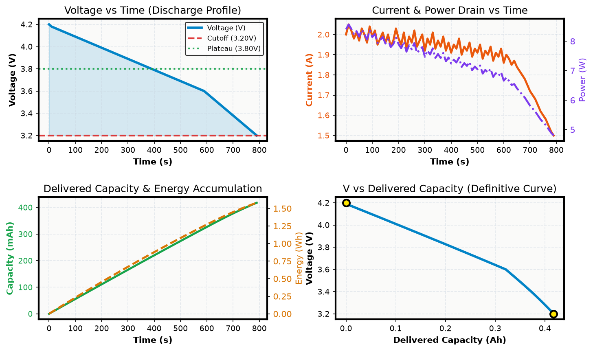
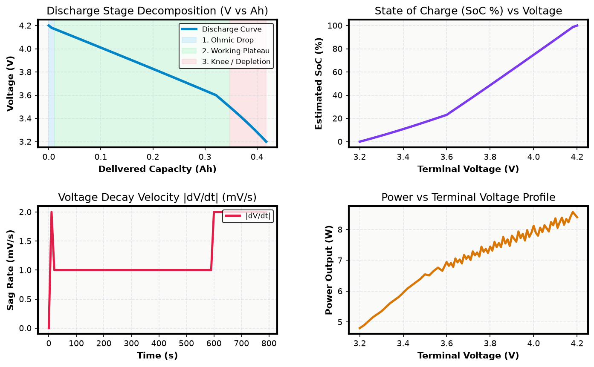
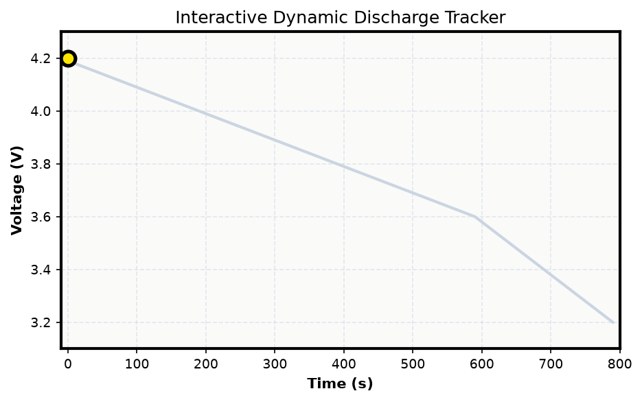

# ⚡ VOLTIX PRO — Neo-Brutalist Battery Analyzer & Electrochemical Telemetry Suite

A high-precision Python battery workstation and desktop GUI engineered for analyzing battery discharge performance, capacity accumulation, energy delivery, internal resistance, and electrochemical degradation.



---

## 📌 Project Overview

**VOLTIX PRO** transforms raw electrochemical test logs into an interactive, high-contrast engineering workstation. Moving deliberately away from muted, dark-mode SaaS interfaces, VOLTIX PRO adopts an authentic **Neo-Brutalist design language**: unblurred hard-edge shadows, heavy black strokes, tactile physical button feedback, vibrant accent color-blocking, and high-DPI scaling.

Built on **PySide6 (Qt 6)**, **Pandas**, **NumPy**, and **Matplotlib**, the workstation delivers real-time synchronized telemetry scrubbing, physical battery cell animation, electrochemical phase segmentation, and one-click export to standalone web reports.

---

## 🎨 The Neo-Brutalist Design System

VOLTIX PRO implements a cohesive, high-impact design system built around raw functional clarity and physical tactility:

| Design Token | Value | Applied To |
| :--- | :--- | :--- |
| **Canvas Background** | `#F4EFE6` | Main window, application background, plot canvases |
| **Surface / Cards** | `#FFFFFF` | Metric KPI containers, control docks, chart boxes |
| **Ink & Outlines** | `#111111` | Primary typography, borders, axes lines, grid ticks |
| **Border Weight** | `2px` – `3px` solid | Hard outlines on all cards, controls, tables, and frames |
| **Drop Shadows** | `4px 4px 0 #111111` | Razor-sharp, unblurred 90° hard offset drop shadows |
| **Corner Radius** | `0px` | Strict, sharp brutalist rectangular geometry |
| **Typography** | `800` – `900` ExtraBold | Punchy metric values, badges, and section headers |

### Vibrant Accent Color-Blocking
* 🔵 **Electric Blue (`#4D9DE0`)**: Voltage discharge tracking, active tab indicators, primary telemetry channels.
* 🟢 **Volt Green (`#7BC043`)**: Delivered energy ($Wh$), capacity ($Ah$), healthy status, Grade A certification.
* 🟡 **Warning Amber (`#F7D046`)**: Table header highlights, status badges, cautionary thresholds, Grade B.
* 🟠 **Energetic Orange (`#F28C28`)**: Dynamic discharge current ($A$), load transients, Grade C warnings.
* 🌸 **Hot Pink (`#E86A92`)**: Instantaneous power ($W$), DC internal resistance ($R_{dc}$), critical alarms.

---

## 🔋 Key Capabilities & Modules

### 1. 🎛️ Cockpit & Synchronized Telemetry Dashboard
* **Synchronized Quad-Plot Workstation**:
  * **Voltage vs Time**: Real-time terminal voltage drop, nominal plateau line, and automated cutoff detection.
  * **Current & Power vs Time**: Dual-axis synchronized dynamic load monitoring.
  * **Capacity & Energy Accumulation**: High-precision trapezoidal numerical integration ($Ah$ / $mAh$ and $Wh$ / $mWh$).
  * **Discharge Curve ($V$ vs Delivered Capacity)**: The benchmark electrochemical fingerprint of the cell under test.
* **Plateau Detection**: Automatically identifies the stable electrochemical discharge plateau ($\bar{V}_{\text{plateau}}$) and knee inflection point.

### 2. 🔬 Electrochemical Phase Breakdown & Diagnostics
* **Tri-Zone Discharge Segmentation**:
  * **Ohmic Drop Phase**: Instantaneous IR drop upon discharge onset ($V_{\text{initial}} \to V_{\text{load}}$).
  * **Stable Working Plateau**: Extended chemical potential phase.
  * **Depletion Knee**: Point of rapid voltage collapse requiring cutoff intervention.
* **Voltage Sag Velocity ($|dV/dt|$)**: Differential sag velocity in $mV/s$ for spotting thermal or kinetic runaway.
* **Dynamic DC Internal Resistance ($R_{dc}$)**: Calculated in $m\Omega$ during current step transitions ($|\Delta I| \ge 25\,\text{mA}$).
* **State of Charge (SoC %)**: Accurate reverse Coulomb-counting profile mapped against open-circuit terminal voltage.

### 3. 🕹️ Real-Time Dynamic Simulation & Physical Battery HUD
* **Animated Battery Cell HUD**: Color-reactive physical battery gauge that depletes graphically with real-time level fill and terminal readouts.
* **Playback Controller**: Scrubbable timeline with `Play`, `Pause`, `Reset`, and speed multipliers (`1x`, `2x`, `5x`, `10x`).
* **Crosshair Cursor**: Multi-chart synchronized cursor that tracks instantaneous values as the test plays back.

### 4. 📑 Standalone Neo-Brutalist HTML Web Report
* Generates [`battery_report.html`](file:///C:/Users/desai/Desktop/Batery%20Analyzer/battery_report.html), an offline, zero-dependency interactive engineering report.
* Styled in full Neo-Brutalism with responsive Chart.js line graphs, telemetry tables, diagnostic badges, and mobile-friendly layouts.

### 5. 🔍 Data Inspector & CSV Exporter
* High-contrast filterable tabular inspector displaying instantaneous calculations ($V$, $I$, $P$, $\Delta t$, $Ah$, $Wh$, $R_{dc}$, $dV/dt$, SoC%).
* Instant search and one-click export to sanitized CSV.

---

## 🖥️ Workstation Gallery

````carousel

<!-- slide -->

<!-- slide -->

````

1. **Top Control Bar**: Select chemistry presets (`Li-ion NMC 4.2V`, `LiFePO4 3.65V`, `LTO 2.8V`, `NiMH 1.45V`), configure nominal rated capacity and cutoff thresholds, or load custom CSVs.
2. **KPI Header Banner**: Instant summary cards displaying Voltage Drop ($\Delta V$), Delivered Capacity, Delivered Energy, Current/Power Peaks, and Internal Resistance.
3. **Dedicated Workstation Tabs**: Fast navigation between the Telemetry Cockpit, Electrochemical Phase Breakdown, Real-Time Simulation, Data Inspector, and Health Audit.

---

## 🛠️ Technology Stack

* **Desktop Workstation**: [PySide6 (Qt 6)](https://www.qt.io/) — Hardware-accelerated Qt6 GUI with custom Neo-Brutalist widgets and tactile event handlers.
* **Numerical Mathematics**: [NumPy](https://numpy.org/) & [Pandas](https://pandas.pydata.org/) — Vectorized cumulative trapezoidal integration, rate-of-change differentiation, and statistical percentiles.
* **Data Visualization**: [Matplotlib](https://matplotlib.org/) — Embedded via `FigureCanvasQTAgg` with custom warm brutalist canvases (`#F4EFE6`), bold tick marks, and color-matched curves.
* **Interactive Web Reporting**: HTML5, Neo-Brutalist CSS3, and [Chart.js](https://www.chartjs.org/) for standalone shareable HTML reports.

---

## 📂 Project Structure

```text
Batery Analyzer/
├── modern_battery_analyzer.py      # Flagship PySide6 Neo-Brutalist workstation GUI & HUD
├── battery_engine.py               # Core numerical engine, metrics dataclass, & HTML generator
├── Battery_data.csv                # Primary sample battery test telemetry dataset
├── battery_report.html             # Standalone interactive Neo-Brutalist HTML report
│
├── tab0_neobrutalist_cockpit.png   # Workstation screenshot: Telemetry Cockpit
├── tab1_neobrutalist_electro.png   # Workstation screenshot: Electrochemical Curves
├── tab2_neobrutalist_sim.png       # Workstation screenshot: Dynamic Simulation HUD
│
├── docs/                           # Deep-dive engineering documentation
│   ├── 01_BATTERY_ENGINE_EXPLAINED.md             # In-depth numerical engine & math breakdown
│   ├── 02_MODERN_BATTERY_ANALYZER_EXPLAINED.md    # Qt6 architecture & widget implementation
│   └── 03_DATASET_AND_HTML_REPORT_EXPLAINED.md    # Telemetry schema & web report guide
│
├── .gitignore                      # Git ignore file
└── README.md                       # Project documentation
```

---

## 🚀 Getting Started

### 1. Prerequisites & Installation

Ensure you have Python 3.10 or newer installed:

```bash
git clone <repo-url>
cd "Batery Analyzer"
pip install PySide6 matplotlib pandas numpy
```

---

### 2. Launching the Workstation

Launch the full interactive Neo-Brutalist GUI:

```bash
python modern_battery_analyzer.py
```

To load a specific battery telemetry dataset directly at launch:

```bash
python modern_battery_analyzer.py path/to/my_battery_data.csv
```

---

### 3. Command-Line & Headless Modes

#### Headless CLI Analysis
Run an instantaneous mathematical analysis in the terminal without opening the GUI:

```bash
python modern_battery_analyzer.py --cli
```

#### Generate Standalone Web Report
Produce the Neo-Brutalist HTML report directly from the CLI:

```bash
python modern_battery_analyzer.py --html
```

---

## 📐 Mathematical & Electrochemical Formulations

### 1. Instantaneous Electrical Power
$$P_i = V_i \times I_i \quad \text{[Watts]}$$

### 2. Cumulative Trapezoidal Capacity Integration
Delivered capacity is computed via cumulative trapezoidal numerical integration across variable sampling intervals $\Delta t$:
$$\text{Capacity}(t) = \frac{1}{3600} \sum_{k=1}^{n} \left(\frac{I_{k-1} + I_k}{2}\right) \Delta t_k \quad \text{[Ampere-hours (Ah)]}$$

### 3. Cumulative Delivered Energy Integration
$$\text{Energy}(t) = \frac{1}{3600} \sum_{k=1}^{n} \left(\frac{P_{k-1} + P_k}{2}\right) \Delta t_k \quad \text{[Watt-hours (Wh)]}$$

### 4. Thermodynamic Mean Discharge Voltage
$$\bar{V}_{\text{discharge}} = \frac{\text{Delivered Energy (Wh)}}{\text{Delivered Capacity (Ah)}} \quad \text{[Volts]}$$

### 5. Dynamic DC Internal Resistance ($R_{dc}$) Estimation
Sampled during dynamic current transitions ($|\Delta I| \ge 0.025\,\text{A}$):
$$R_{dc} \approx \frac{|\Delta V|}{|\Delta I|} \times 1000 \quad \text{[milliohms } (m\Omega)\text{]}$$

### 6. Voltage Sag Velocity
Differential rate of terminal voltage collapse:
$$\frac{dV}{dt} = \frac{V_k - V_{k-1}}{\Delta t_k} \times 1000 \quad \text{[mV/s]}$$

### 7. State of Charge (Coulomb Counting)
$$\text{SoC}(t) = 100 \times \left(1 - \frac{\text{Capacity}(t)}{\text{Capacity}_{\text{total}}}\right) \quad [\%]$$

---

## 📚 Deep-Dive Technical Documentation

For complete line-by-line architectural and implementation details, refer to the documentation in [`docs/`](file:///C:/Users/desai/Desktop/Batery%20Analyzer/docs):

* [`docs/01_BATTERY_ENGINE_EXPLAINED.md`](file:///C:/Users/desai/Desktop/Batery%20Analyzer/docs/01_BATTERY_ENGINE_EXPLAINED.md): Mathematical formulations, numerical algorithms, dataclass architecture, and validation checks.
* [`docs/02_MODERN_BATTERY_ANALYZER_EXPLAINED.md`](file:///C:/Users/desai/Desktop/Batery%20Analyzer/docs/02_MODERN_BATTERY_ANALYZER_EXPLAINED.md): PySide6 interface implementation, custom brutalist widgets, drop shadows, and multi-canvas plotting.
* [`docs/03_DATASET_AND_HTML_REPORT_EXPLAINED.md`](file:///C:/Users/desai/Desktop/Batery%20Analyzer/docs/03_DATASET_AND_HTML_REPORT_EXPLAINED.md): Telemetry dataset specifications, Chart.js templates, and export mechanics.

---

## 👨‍💻 License

Developed for high-precision battery performance analysis, laboratory testing, and engineering education.  
Open-source under the **MIT License**.
