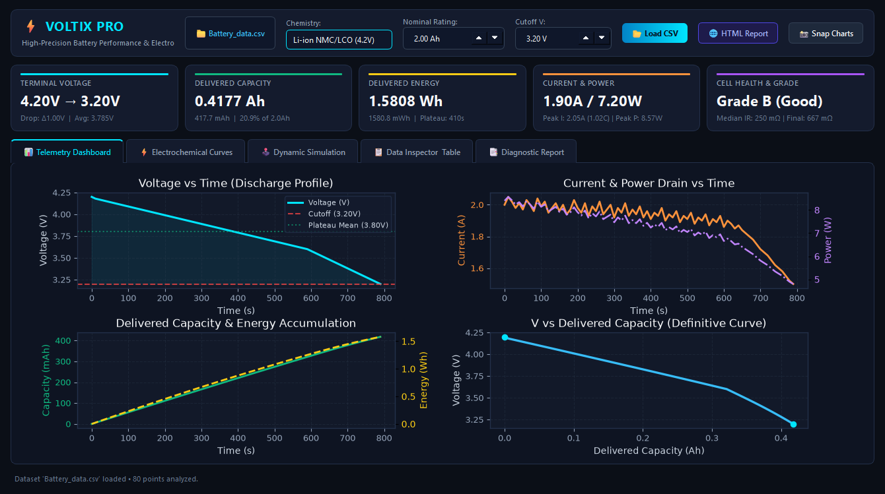
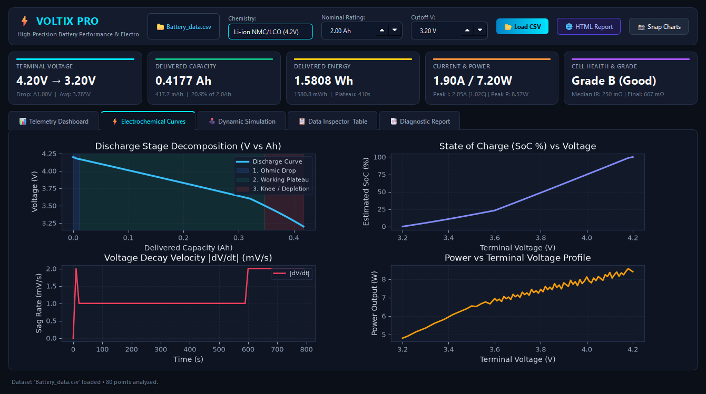
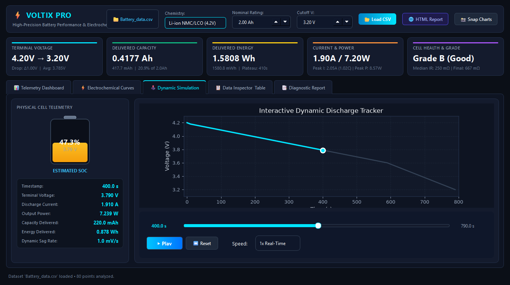
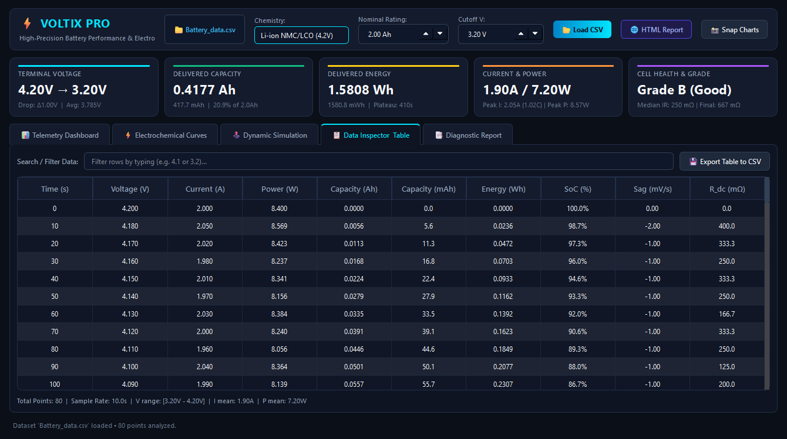
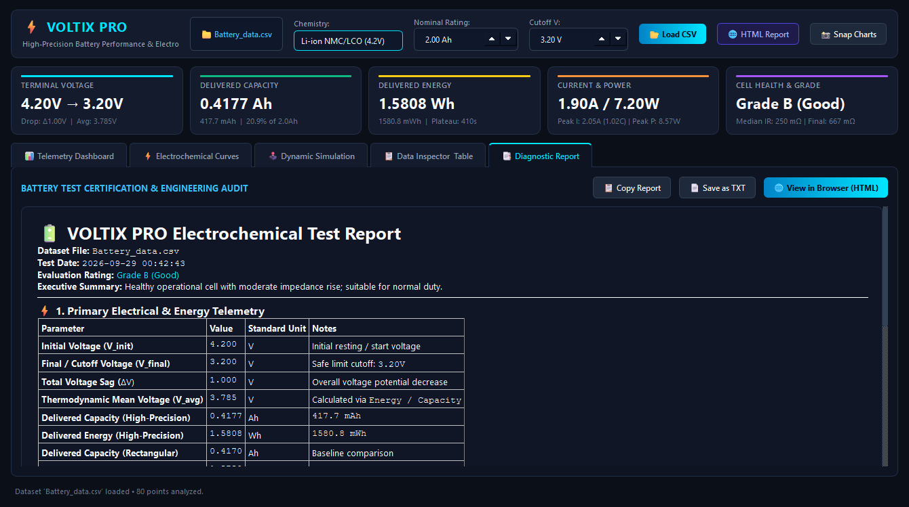

# ⚡ VOLTIX PRO — Modern Battery Analyzer & Electrochemical Telemetry Suite

A modern, high-precision Python battery analysis workstation and interactive GUI application for analyzing battery discharge performance, capacity, energy, internal resistance, and electrochemical health.



---

## 📌 Project Overview

**VOLTIX PRO** transforms raw battery telemetry data into an interactive, visual engineering experience. Built with **PySide6 (Qt6)**, **Pandas**, **NumPy**, and **Matplotlib**, it provides real-time telemetry playback, multi-channel synchronized plots, electrochemical phase decomposition, and automated diagnostic reports.

### Key Capabilities

* ⚡ **Modern Cyber-Engineering Interface**: Deep dark aesthetic (`#0B0F19`) with glowing neon accents, responsive layout, and high-DPI scaling.
* 🔋 **Interactive Physical Battery HUD**: Real-time animated battery gauge showing cell level depletion, terminal voltage, and instantaneous metrics.
* 🕹️ **Dynamic Simulation Playback**: Scrubbable timeline with `Play`, `Pause`, `Reset`, and speed multiplier controls (`1x`, `2x`, `5x`, `10x`) with a real-time tracking cursor.
* 📊 **Multi-Channel Synchronized Charts**:
  * **Voltage vs Time** (with cutoff threshold & working plateau lines)
  * **Current & Power vs Time** (dual-axis dynamic load tracking)
  * **Capacity & Energy Accumulation** (Ah/mAh & Wh/mWh vs Time)
  * **V vs Delivered Capacity** (the definitive battery discharge curve)
* 🔬 **Electrochemical Diagnostics**:
  * **Discharge Phase Breakdown**: Ohmic drop, working plateau, and knee depletion zones.
  * **State of Charge (SoC %)** vs Voltage curve.
  * **Voltage Sag Rate ($|dV/dt|$)** in $mV/s$.
  * **DC Internal Resistance ($R_{dc}$)** estimation in $m\Omega$.
* 📑 **Comprehensive Diagnostics & Reporting**:
  * Automated cell grading (`Grade A`, `Grade B`, `Grade C`).
  * Safety compliance checks (cutoff voltage violations, high sag rates, over-current).
  * One-click **Interactive HTML Report** export with interactive Chart.js graphs.
  * Tabular data inspector with real-time text filtering and CSV export.

---

## 🛠️ Architecture & Technologies

* **GUI Framework**: [PySide6 (Qt 6)](https://www.qt.io/) — Native, hardware-accelerated desktop workstation interface.
* **Data Processing**: [Pandas](https://pandas.pydata.org/) & [NumPy](https://numpy.org/) — High-precision numerical analysis and trapezoidal integration.
* **Visualization**: [Matplotlib](https://matplotlib.org/) — Custom dark cyber-themed plots embedded via `FigureCanvasQTAgg`.
* **Web Reporting**: HTML5, CSS3 Glassmorphism, and [Chart.js](https://www.chartjs.org/) for standalone shareable interactive web reports.

---

## 📂 Project Structure

```text
Batery Analyzer/
│
├── modern_battery_analyzer.py   # Flagship PySide6 GUI application & HUD
├── battery_engine.py            # Core battery math, diagnostics, & HTML generator
├── Battery_data.csv             # Primary battery test telemetry dataset
├── battery_report.html          # Standalone interactive browser report
├── tab0_dashboard.png           # Telemetry Dashboard screenshot
├── tab1_electrochemistry.png    # Electrochemical Curves screenshot
├── tab2_simulation.png          # Dynamic Simulation HUD screenshot
├── tab3_inspector.png           # Data Inspector Table screenshot
├── tab4_report.png              # Diagnostic Report screenshot
└── README.md                    # Project documentation
```

---

## 🚀 Getting Started

### 1. Requirements

Ensure you have Python 3.10+ installed. Install the dependencies:

```bash
pip install PySide6 matplotlib pandas numpy
```

---

### 2. Launching the Modern Interface

To open the modern interactive GUI application:

```bash
python modern_battery_analyzer.py
```

You can also pass a custom CSV file directly:

```bash
python modern_battery_analyzer.py path/to/my_battery_data.csv
```

---

### 3. Additional Execution Modes

#### Headless / Terminal Mode
To print the full engineering analysis and save a summary report without launching the GUI:

```bash
python modern_battery_analyzer.py --cli
```

#### Generate Standalone Interactive Web Report
To generate an interactive HTML report viewable in any web browser:

```bash
python modern_battery_analyzer.py --html
```

---

## 📐 Mathematical & Engineering Formulations

### 1. Instantaneous Power
$$P_i = V_i \times I_i \quad \text{[Watts]}$$

### 2. High-Precision Trapezoidal Capacity Integration
Delivered capacity is calculated using cumulative trapezoidal numerical integration over sample intervals $\Delta t$:
$$\text{Capacity}(t) = \frac{1}{3600} \sum_{k=1}^{n} \left(\frac{I_{k-1} + I_k}{2}\right) \Delta t_k \quad \text{[Ampere-hours (Ah)]}$$

### 3. High-Precision Delivered Energy Integration
$$\text{Energy}(t) = \frac{1}{3600} \sum_{k=1}^{n} \left(\frac{P_{k-1} + P_k}{2}\right) \Delta t_k \quad \text{[Watt-hours (Wh)]}$$

### 4. Thermodynamic Mean Discharge Voltage
$$\bar{V}_{\text{discharge}} = \frac{\text{Delivered Energy (Wh)}}{\text{Delivered Capacity (Ah)}} \quad \text{[Volts]}$$

### 5. DC Internal Resistance ($R_{dc}$) Estimation
Estimated from dynamic current transitions where $|\Delta I| \ge 0.025\,\text{A}$:
$$R_{dc} \approx \frac{|\Delta V|}{|\Delta I|} \times 1000 \quad \text{[milliohms } (m\Omega)\text{]}$$

### 6. Voltage Sag Velocity
$$\frac{dV}{dt} = \frac{V_k - V_{k-1}}{\Delta t_k} \times 1000 \quad \text{[mV/s]}$$

### 7. State of Charge (SoC %)
$$\text{SoC}(t) = 100 \times \left(1 - \frac{\text{Capacity}(t)}{\text{Capacity}_{\text{total}}}\right) \quad [\%]$$

---

## 🖥️ User Interface Tour

````carousel

<!-- slide -->

<!-- slide -->

<!-- slide -->

<!-- slide -->

````

1. **Top Header & Chemistry Selector**:
   - Select chemistry presets: `Li-ion NMC (4.2V)`, `LiFePO4 (3.65V)`, `LTO (2.8V)`, `NiMH (1.45V)`, or custom.
   - Adjust nominal rated capacity and cutoff threshold on the fly.
   - Quick action buttons to load any CSV, export HTML reports, and save high-resolution chart snapshots.
2. **KPI Metrics Banner**:
   - Real-time glassmorphic cards showing Terminal Voltage, Delivered Capacity ($Ah$ / $mAh$), Delivered Energy ($Wh$ / $mWh$), Dynamic Current & Power, and Cell Health Grade.
3. **5 Dedicated Tabs**:
   - **Telemetry Dashboard**: 4 synchronized subplots with custom dark styling and plateau markers.
   - **Electrochemical Curves**: Detailed $V$ vs $Ah$ discharge curve with shaded phases (Ohmic, Plateau, Knee), OCV-SoC profile, $dV/dt$ sag rate, and Power vs Voltage.
   - **Dynamic Simulation**: Visual battery cell draining in real time, digital HUD indicators, scrub slider, and animated graph cursor.
   - **Data Inspector Table**: Filterable table with all calculated engineering metrics and instant CSV export.
   - **Diagnostic Report**: Audit report with cell grade, degradation analysis, and one-click copy/save options.

---

## 👨‍💻 Author & License

Developed for high-precision battery performance analysis and engineering education.  
Open-source under the MIT License.
